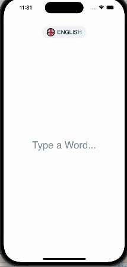

# DictionMaster

## Descrição
DictionMaster é um dicionário em inglês desenvolvido para aprimorar o vocabulário e fornecer informações detalhadas sobre palavras em inglês. Utilizando a API [DictionaryAPI](https://dictionaryapi.dev), o aplicativo oferece **definições**, **pronúncia**, **significados** e **exemplos**. Desenvolvido em SwiftUI, com suporte a persistência de dados usando CoreData, gerenciamento de cache com NSCache, reprodução de áudio com AVAudioPlayer e seguindo a arquitetura MVVM.

## Tecnologias Utilizadas
- **SwiftUI**: Framework de IU moderno e declarativo para criar interfaces de usuário eficientes.
- **CoreData**: Framework para gerenciamento de dados persistente, utilizado para armazenar e recuperar dados localmente.
- **NSCache**: Utilizado para armazenar em cache dados temporários, melhorando o desempenho e economizando recursos.
- **AVAudioPlayer**: Usado para reprodução de áudio, permitindo aos usuários ouvir a pronúncia correta das palavras.
- **Alamofire**: Biblioteca para requisições HTTP simplificadas em Swift.
- **MVVM (Model-View-ViewModel)**: Padrão de arquitetura que separa a lógica de apresentação da lógica de negócios.

## Recursos
- **Definições**: Obtenha definições detalhadas de palavras em inglês.
- **Pronúncia**: Ouça a pronúncia correta das palavras.
- **Significados e Exemplos**: Compreenda os usos da palavra em diferentes contextos.
- **Histórico de Pesquisas**: Permite ao usuário acessar palavras previamente pesquisadas.

## Vídeo de Demonstração
O vídeo acabou perdendo qualidade quando foi transformado para gif, porém o vídeo original está disponível na pasta [DictionMasterBrunaPoso/Video/](./DictionMasterBrunaPoso/Video/).

  
  

